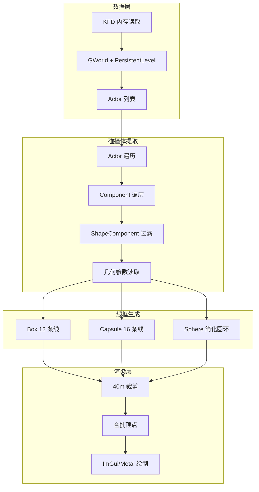

# PhysX 碰撞体可视化调试工具 - 集成方案

## 数据来源与可行性

和平精英为 UE4 游戏，物理由 PhysX 驱动。**不直接读取 PxScene**（需逆向 UE4 内部布局，版本敏感），改为从 **PrimitiveComponent / ShapeComponent** 读取碰撞几何：

- 现有代码已遍历 `PersistentLevel` 的 Actor 列表
- `PrimitiveComponent` 含 `BodyInstance`（0x468）、`ComponentToWorld`（0x1F0）
- `CapsuleComponent` / `BoxComponent` / `SphereComponent` 继承 `ShapeComponent`，含几何参数
- 几何 + 变换即可生成世界空间线框，无需接触 PhysX 内部结构



---

## 1. 碰撞体提取模块（ColliderExtractor）

**文件**：新建 `sources/PhysXColliderExtractor.hpp`（或 `.mm`）

**职责**：从 UE4 组件提取碰撞几何，输出统一结构体。

**数据结构**：
```cpp
enum ColliderType { Box, Capsule, Sphere };
struct ColliderData {
    ColliderType type;
    Vector3 center;      // 世界坐标
    Vector3 halfExtent; // Box: 半长; Capsule: (radius, radius, halfHeight)
    // Capsule 还需 axis (默认 Z)
};
```

**提取逻辑**：
- 在现有 `读取()` 的 Actor 循环中，对每个 Actor 调用 `KFD::Read<long>(actor + 0x1A0)` 获取 `ComponentArray`（或等效偏移，需对照 SDK）
- 遍历 Component，用 `GetFName` 判断是否为 `CapsuleComponent`、`BoxComponent`、`SphereComponent`
- 读取 `ComponentToWorld`（0x1F0）、`CapsuleHalfHeight`/`CapsuleRadius`、`BoxExtent`、`SphereRadius`
- 计算世界空间 center 与 halfExtent，写入 `ColliderData`
- **距离裁剪**：`GetDistance(collider.center, playerPos) > 4000`（40m = 4000cm）则跳过

**更新频率**：用静态 `lastExtractTime`，仅当 `now - lastExtractTime >= 0.1`（10Hz）时执行提取，结果缓存到 `static std::vector<ColliderData> s_cachedColliders`。

---

## 2. 线框生成（WireframeGenerator）

**文件**：`sources/PhysXWireframeGen.hpp` 或同一模块内

**输入**：`std::vector<ColliderData>`

**输出**：`std::vector<LineSegment>`，`LineSegment = { Vector3 from, Vector3 to }`

**规则**：
- **Box**：8 顶点 → 12 条边（每边 1 条线）
- **Capsule**：上下两圆（各 8 点）+ 4 条竖线 ≈ 16 条线
- **Sphere**：3 个正交圆环，每环 12 段 ≈ 36 条线（可减到 16 条）

所有顶点用 `ComponentToWorld` 变换到世界空间。

---

## 3. 渲染集成（RenderIntegration）

**位置**：在 [sources/SHRenderView.mm](sources/SHRenderView.mm) 的绘制主循环中，在雷达/ESP 之后。

**流程**：
1. 若 `绘制PhysX碰撞体` 为 false，直接跳过
2. 调用 `ColliderExtractor::ExtractIfNeeded()` 更新 `s_cachedColliders`
3. 调用 `WireframeGenerator::Generate(s_cachedColliders)` 得到 `s_lineSegments`
4. 用现有 `WorldToScreen` 将每条线段的起止点转为屏幕坐标
5. 使用 `绘制图形->AddLine(ImVec2 from, ImVec2 to, color, thickness)` 绘制

**性能**：
- 提取 10Hz，渲染 60fps（每帧只画缓存线段）
- 单色、无复杂 Shader
- 线段数量受 40m 裁剪和类型限制，预计 < 500 条/帧

---

## 4. 悬浮菜单开关

**文件**：[sources/FloatingExtras/oc悬浮菜单.mm](sources/FloatingExtras/oc悬浮菜单.mm)

- 新增 `BOOL 绘制PhysX碰撞体 = NO;`
- 在“人物绘制”页增加开关：“PhysX碰撞体” / “碰撞体线框”，key `@"AAphysxcollider"`
- 在 [sources/SHRenderView.mm](sources/SHRenderView.mm) 中 `extern BOOL 绘制PhysX碰撞体;`

---

## 5. UE4 偏移与 Component 遍历

**需确认的偏移**（以和平精英 1.35.12 SDK 为准）：
- `Actor + 0x1A0`：`TArray<UActorComponent*> OwnedComponents` 或等效
- `CapsuleComponent`：`0x7c8` CapsuleHalfHeight，`0x7cc` CapsuleRadius（已有）
- `BoxComponent`：需查 `BoxExtent` 偏移
- `SphereComponent`：`SphereRadius` 偏移

若 SDK 中无 `OwnedComponents` 精确偏移，可退化为：**仅处理已识别的 Actor 类型**（如 `PlayerCharacter` 的 CapsuleComponent 在 `0x660`），先实现 Capsule，再扩展 Box/Sphere。

---

## 6. AI 分析层（预留接口）

**文件**：`sources/PhysXAIAnalysis.hpp`（可选，首版可空实现）

**接口**：
```cpp
struct CollisionAnalysisResult {
    bool pathReachable;
    bool hasOcclusion;
    // ...
};
CollisionAnalysisResult AnalyzeColliders(const std::vector<ColliderData>& colliders, Vector3 from, Vector3 to);
```

AI 仅在此类函数内做逻辑分析，**不参与每帧渲染或提取**。后续可接入射线检测、路径可达性等。

---

## 7. 实现顺序与文件清单

| 步骤 | 文件 | 内容 |
|------|------|------|
| 1 | `sources/PhysXColliderExtractor.hpp` | ColliderData、ExtractIfNeeded、10Hz 节流、40m 裁剪 |
| 2 | `sources/PhysXWireframeGen.hpp` | Box/Capsule/Sphere 线框生成 |
| 3 | `sources/SHRenderView.mm` | 调用提取+生成，WorldToScreen+AddLine 绘制 |
| 4 | `sources/FloatingExtras/oc悬浮菜单.mm` | 开关“PhysX碰撞体” |
| 5 | `Makefile` | 将新 `.hpp` 加入编译（若需） |

---

## 8. 风险与降级

- **Component 遍历失败**：若无法可靠遍历所有 Component，则仅绘制已知偏移的 Capsule（如角色 0x660），作为最小可用版本
- **Convex / TriangleMesh**：UE4 中通常挂在复杂 StaticMesh，逆向成本高，首版不实现，仅支持 Box/Capsule/Sphere
- **性能**：若线段过多导致卡顿，可进一步降低更新频率（5Hz）或缩小裁剪距离（30m）
